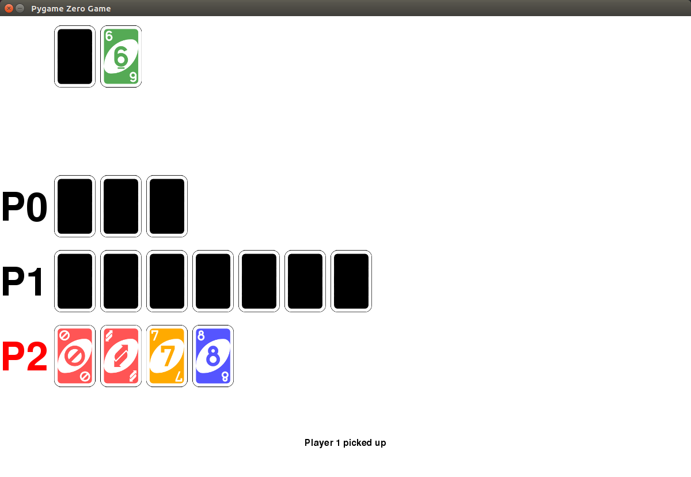

# Uno

Some unit tested Python code to model the card game Uno

## Rules

https://en.wikipedia.org/wiki/Uno_(card_game)#Official_rules

## Usage

An example auto-generated game of 5 players:

```python
from uno import UnoGame, COLORS
import random

game = UnoGame(5)

while game.is_active:
    player = game.current_player
    player_id = player.player_id
    if player.can_play(game.current_card):
        for i, card in enumerate(player.hand):
            if game.current_card.playable(card):
                if card.color == 'black':
                    new_color = random.choice(COLORS)
                else:
                    new_color = None
                print("Player {} played {}".format(player, card))
                game.play(player=player_id, card=i, new_color=new_color)
                break
    else:
        print("Player {} picked up".format(player))
        game.play(player=player_id, card=None)
```

See [random_game.py](random_game.py)

## AI

A simple interactive AI version of the game can be played using keyboard inputs. Just create an instance of `AIUnoGame` with the required number of players:

```python
from uno import AIUnoGame

game = AIUnoGame(5)
```

You will be assigned a player number at random, and will be asked to make your move when it is your turn. Enter card numbers as a zero-based index, and colours as lowercase strings. (I'll tidy that up later)

## Graphical game

A graphical version of the game can be played, developed using [pygame-zero](http://pygame-zero.readthedocs.io/).



Install pygame zero with:

```bash
sudo pip3 install pgzero
```

And run the game with:

```bash
pgzrun uno_pgz.py
```
